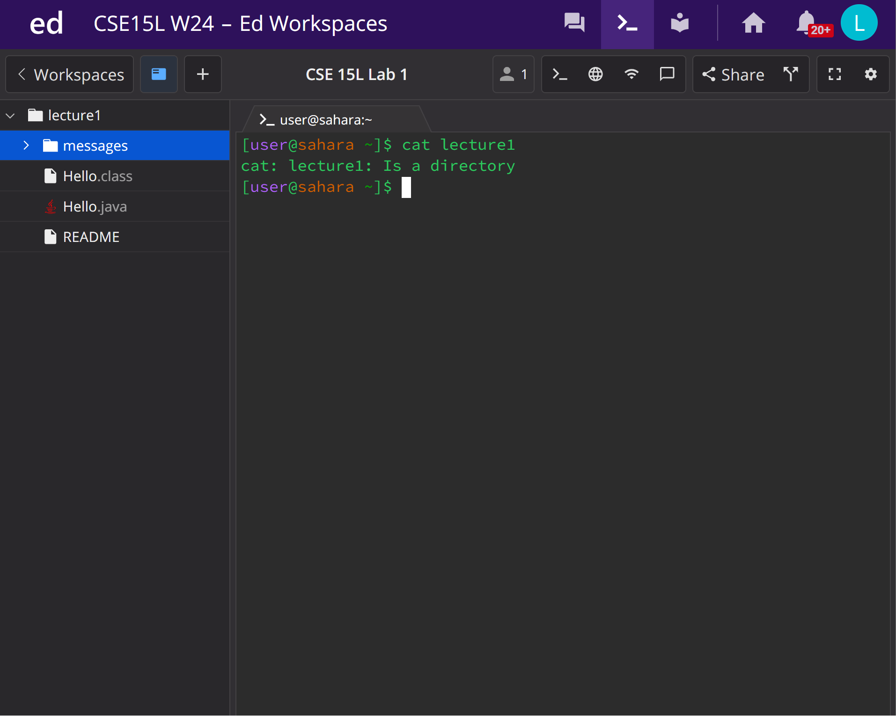

## Lab Report 1
---
For the command `cd` I ran it in the edstem workspace with 3 different variations. 
1. First variation being with *no* argupments. Here is what it looks like. The first variation is considered as no arguments because as you can see I am just running the command, I am not adding anything else after the command as an input. The command still runs but instead of changing directories, the directory still stays the same. In this case the working directory is `/home`.

2. Second variation being with a path to a *directory* as an argument. Here is what it looks like. With the second variation here we see that there is no actual output when running the command with "lecture1" as an argument. This is because the command is intended to change directory, which we see is the case shown by `[user@sahara ~/lecture1]$`. This tells us that our working directory is now lecture1.

3. Third variation being with a path to a *file* as an argument. Here is what it looks like. It throws an error because the given argument is not a valid directory or folder. Therefore it runs into the error shown.

---
For the command `ls` I ran it in the edstem workspace with 3 different variations.
1. First variation being with *no* arguments. Here is what it looks like. The first variation is considered as no arguments because as you can see I am just running the command, I am not adding anything else after the command as an input. The command `ls` only returns "lecture1" as the only file present because it is in the `/home` directory, therefore lecture1 is the only folder present.

2. Second variation being with a path to a *directory* as an argument. Here is what it looks like. Now that we have given it a directory argument, we can now see all of the files and folders in the lecture1 folder. However, even though the command is showing us folders and files from another directory the working directory is still `/home`.

3. Third variation being with a path to a *file* as an argument. Here is what it looks like. It runs into an error because there is no file with the name `Hello.java`. This is because the command is working in the `/home` directory and there is no `Hello.java` file there, only the directory `lecture1`.

---
For the command `cat` I ran it in the edstem workspace with 3 different variations.
1. First variation being with *no* arguments. Here is what it looks like. The first variation is considered as no arguments because as you can see I am just running the command, I am not adding anything else after the command as an input. We are working in the `/home` directory.

3. Second variation being with a path to a *directory* as an argument. Here is what it looks like. Here we are still working in the `/home` directory. The output looks this way because the `cat` command is intended to print the contents of the files given by the argument. Here we are giving it the directory `lecture1` to print out.

5. Third variation being with a path to a *file* as an argument. Here is what it looks like. Now for this variation we run into an error. This is caused by the working directory still being `/home`, so it does not have access to the file `Hello.class`.

