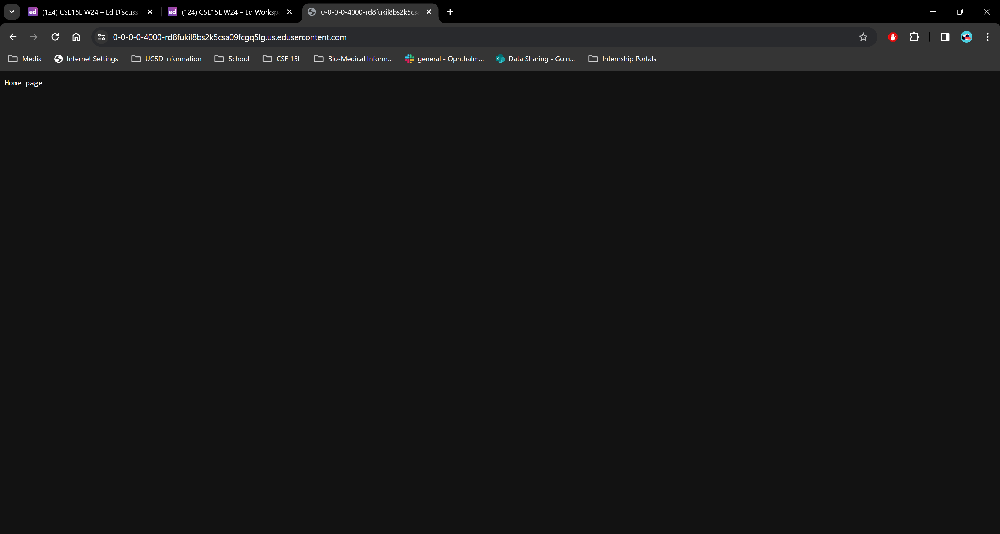

# Part 1
Below are two screenshots of my code used for the ChatServer.

In the screenshot shown below, it shows the webserver when there are no queries added. For the home page the method being called is the `String handleRequest` method. And the website content is generated by lines 9-11. The only relevant argument to the method at this point is the "/" being at the end of the URL. This tells the code to generate the "Home page" message. At this point no values have been changed yet. This is because we are not adding any queries to the URL link.

Here is another screenshot of the webpage after adding in a query that tells the code the user and the message the user gave. At this point in order for the webpage to generate the message "jpolitz: Hello", the code is using lines 12-31 of the code and it is still using the `String handleRequest` method. By checking if the URL variable contains "/add-message" it tells the code that we are starting a chat and following that we begin splitting the query to isolate the message and separate it. At the end of the first message being set, the message is set to be equal to `chatMessage` and added to `chatHistory`. Additionally, messageVar and userVar are also changed to be equal to what the user wanted as the message and their username. The same process is also used in the second screenshot below.

----------------------------------------------------------------------------------------------------------------------------------------------------------------------------------------------
# Part 2
Below is the absolute path to the private key for my SSH key to log into `ieng6`. In the same screenshot you can also see the public key labeled as "id_rsa.pub" and the private key is "id_rsa". This was done in a terminal in VSCode on my own personal computer.

Below is the absolute path to the keys on the `ieng6` remote computer. As previously stated, the public key is labeled as "id_rsa.pub" and the private key is "id_rsa". This was done in a terminal in VSCode on my own personal computer.

Below is the screenshot that shows me logging into `ieng6` without using my password, but instead using the SSH key I generated in the previous screenshot.

----------------------------------------------------------------------------------------------------------------------------------------------------------------------------------------------
# Part 3
This week in lab was really interesting. It was interesting to learn how to access UCSD computers remotely and how to manipulate code to produce websites that are run either on local or remote servers. It was also interesting to learn about ports and what they provide as a tool for people in computer science.
----------------------------------------------------------------------------------------------------------------------------------------------------------------------------------------------
