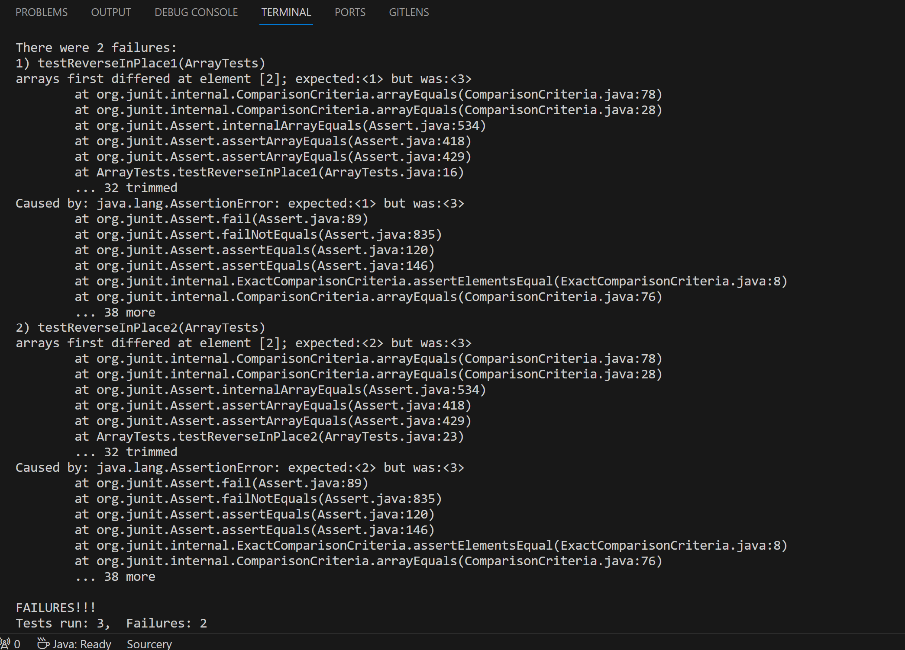

# Part 1
Here is the first test case that I created to test the `reverseInPlace()` method. And we can see that it has an initial input of an int[]{1, 2, 3}. However when running the method on the input it failed telling me that there is something wrong with the method. 
```
@Test
public void testReverseInPlace1() {
    int[] input2 = {1, 2, 3};
    ArrayExamples.reverseInPlace(input2);
    assertArrayEquals(new int[]{3, 2, 1}, input2);
}
```
Here is the test case that was already there that did not fail the `reverseInPlace()` method. It has an initial input an int[]{3}. And when running we see that it is still returning the same array so we know the method is not deleting any elements in the array.
```
@Test 
public void testReverseInPlace() {
    int[] input1 = { 3 };
    ArrayExamples.reverseInPlace(input1);
    assertArrayEquals(new int[]{ 3 }, input1);
}
```
Below is the symptom from the terminal after running the test cases with the buggy code.


Here is the code before any changes were made.
```
static void reverseInPlace(int[] arr) {
  for(int i = 0; i < arr.length; i += 1) {
    arr[i] = arr[arr.length - i - 1];
  }
}
```

And here is the code after being changed to meet the requirements.
```
static void reverseInPlace(int[] arr) {
    for(int i = 0; i < arr.length / 2; i ++) {
      int temp = arr[i]; 
      arr[i] = arr[arr.length - i - 1]; 
      arr[arr.length - i - 1] = temp;
    }
}
```
The main changes in the new code is that I changed the for loop to iterate through only half of the array and introduced a new variable called `temp` that would store the first half of elements. After storing the first half of elements the for loop will proceed to move the back half of the elements to the front and the `temp` elements to the back.

-----------------------------------------------------------------------------------------------------------
# Part 2
For this portion of the report I chose to research more about the `grep` command. I think that it was the most versatile command throughout the lab.

First `grep` command I found interesting was `grep -c` which would return the count of lines that would match the pattern given.

In this case I used `grep -c` on a directory, which was not very useful because the command is not meant to be ran on a directory.
```
local $ grep -c ".txt" technical/
grep: technical/: Is a directory
0
```
In this next example of `grep -c` it was very useful because I used it on an actual file it told me how many lines there were. I find this useful when trying to figure out how many files there are in a txt file.
```
local $ grep -c ".txt" find-results.txt
252
```
Second `grep` command I found interesting was `grep -h` which display the matched lines, but do not display the filenames. However when running the command it still printed out the filenames.

In this case I used `grep -h` on a directory, which was not very useful because the command is not meant to be ran on a directory.
```
local $ grep -h ".txt" technical/911report
grp: technical/911report: Is a directory
```
In this next example of `grep -h` it was very useful because I used it on an actual file and it printed out the files that fulfilled the requirement. I find this being useful for finding files that include a specific label.
```
local $ grep -h ".txt" biomed-pair.txt
technical/biomed/1471-2091-3-4.txt
...
```
Third `grep` command I found interesting was `grep -v` which displays all the lines that do not matche the pattern.

In this case I used `grep -v` on a directory, which was not very useful because the command is not meant to be ran on a directory.
```
local $ grep -v "14" technical/
grep: technical/: Is a directory
```
In this next example of `grep -v` it was very useful because I used it on an actual file and it printed out the files that did not have the number 14 in it. In the future I can see myself using it to exclude specific files.
```
local $ grep -v "14" biomed-pair.txt
technical/biomed/ar297.txt
...
```
Fourth `grep` command I found interesting was `grep -n` which displays the matched lines and their line numbers.

In this case I used `grep -n` on a directory, which was not very useful because the command is not meant to be ran on a directory.
```
local $ grep -n "14" technical/
grep: technical/: Is a directory
```
In this next example of `grep -n` it was very useful because it did print out all of the lines and their line numbers so I can see how many files met the requirement.
```
local $ grep -n "14" biomed-pair.txt
1:technical/biomed/1471-2091-3-4.txt
...
```

