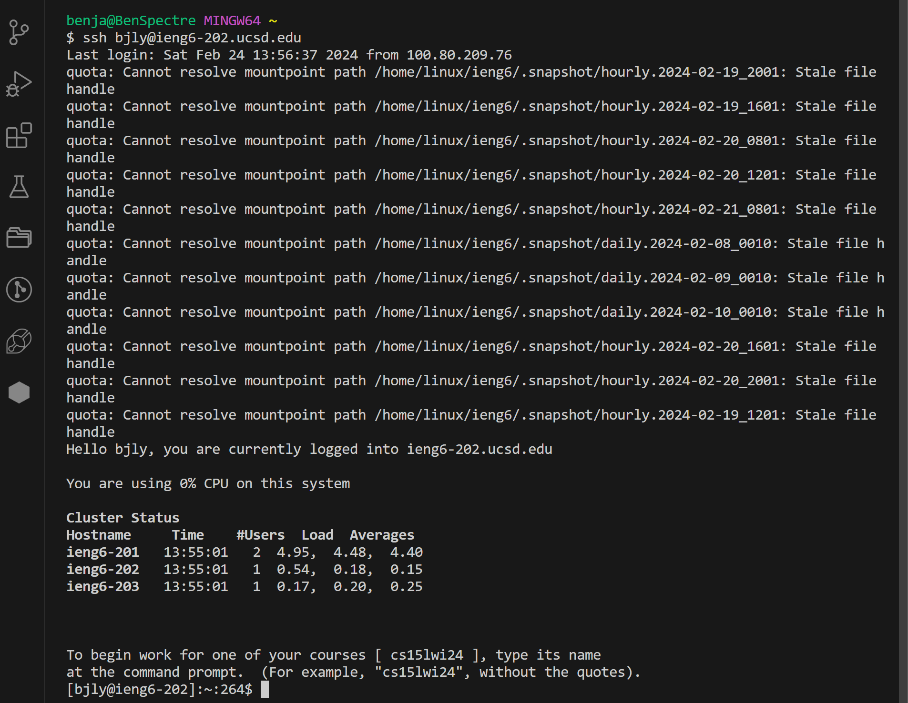
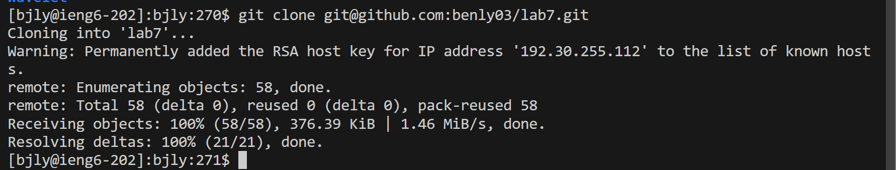
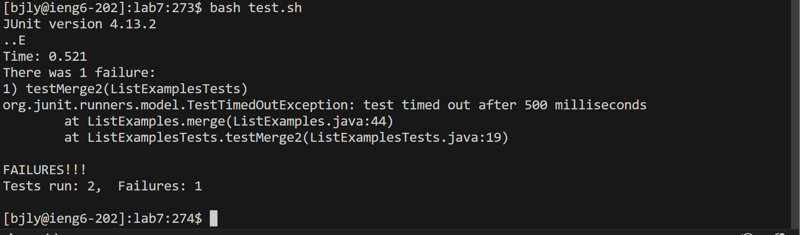
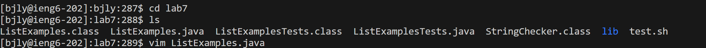
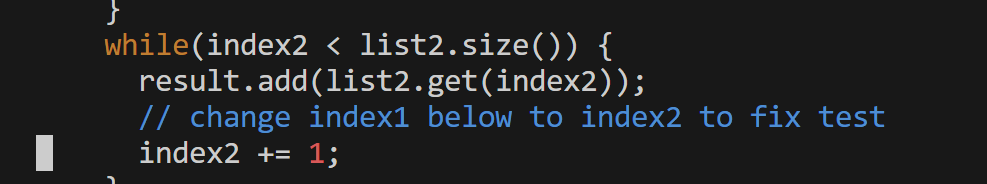
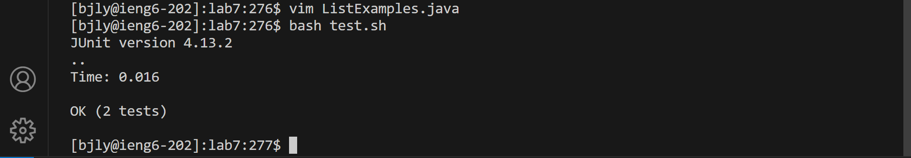
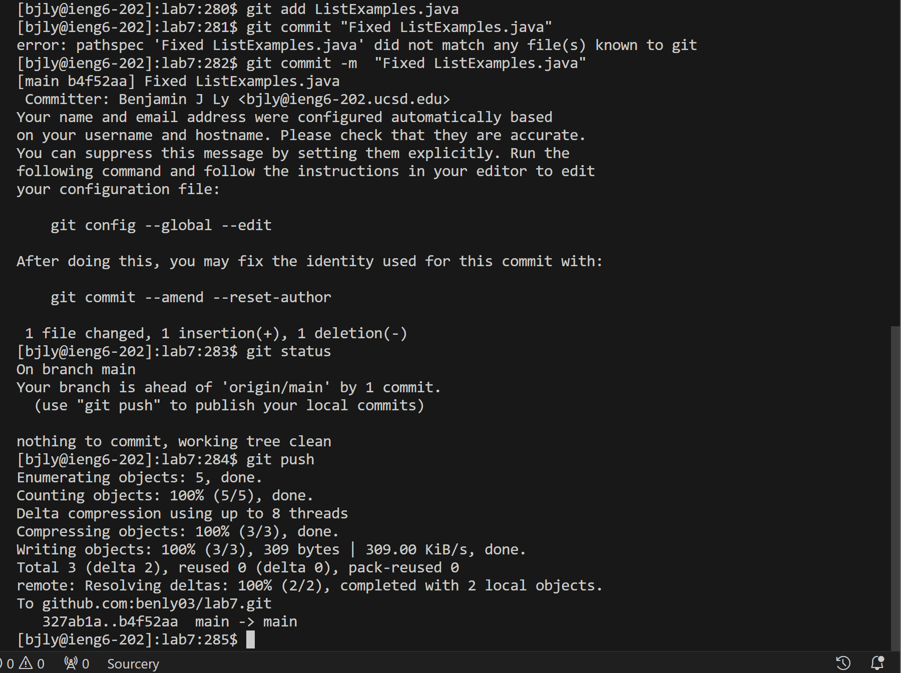

For the lab report this week, reproduce the task from above on your own. For each numbered step starting right after the timer (so steps 4-9), take a screenshot, and write down exactly which keys you pressed to get to that step. For special characters like <enter> or <tab>, write them in angle brackets with code formatting. Then, summarize the commands you ran and what the effect of those keypresses were.
# Step 4 - Log into ieng6
In the screenshot below is a simple command that I ran to log into UCSD's remote computer for the lab. Additionally, normally it would prompt me to input my password to login however with the use of SSH keys I am able to log in without it prompting me to enter my password. I did this by using this command, `ssh bjly@ieng6-202.ucsd.edu` then pressing `<enter>` to run the command.

# Step 5 - Clone your fork of the repository from your Github account (using the SSH URL)
In the screenshot below I was able to clone a fork of the lab7 repository from my GitHub account using SSH keys. The process is similar to the SSH keys used to log into UCSD's `ieng6` machines. To do this I ran this code `git clone git@github.com:benly03/lab7.git` then pressing `<enter>` to run the command.

# Step 6 - Run the tests, demonstrating that they fail
After cloning into the repository, I changed my working directory to be `lab7` then ran the command `bash test.sh` and pressing `<enter>` to run the test cases. By running the test cases I was able to see that one test case failed and what the error was.

# Step 7 - Edit the code file to fix the failing test
In the screenshot below I used the command `vim ListExamples.java` and pressed `<enter>` to access the java file in vim. Now with access to the file I am able to edit the `.java` file and fix any errors that was causing the test case to fail. In order to fix the error I had to press my `<down>` key 43 times then my `<right>` key 11 times. This put me at the typo in the code that was causing the error. To fix the error, I pressed "x" to delete the typo, then "i" to insert "2". This effectively changed "index1" to "index2", thus fixing the code. To save changes I then pressed `esc` to exit and go to normal mode. I then pressed ":wq" and `<enter>` to save changes and quit the file. 

 
# Step 8 - Run the tests, demonstrating that they now succeed
After quitting the file I ran the command `bash test.sh` by typing it in then pressing `<enter>` and the test passed.

# Step 9 - Commit and push the resulting change to your Github account (you can pick any commit message!)
After fixing the `ListExamples.java` file to pass all test cases I needed to reflect those changes on my GitHub repository. To do so, I first began with typing in the command `git add ListExamples.java` and pressed `<enter>` to run the command. This added the ListExamples.java to repository. Next I committed the changes and added a message that reflected the changes I made with the command `git commit -m "Fixed ListExamples.java"` and pressed `<enter>` to run the commands. Lastly I typed in `git push` and pressed `<enter>` to push the changes and message to the repository.

