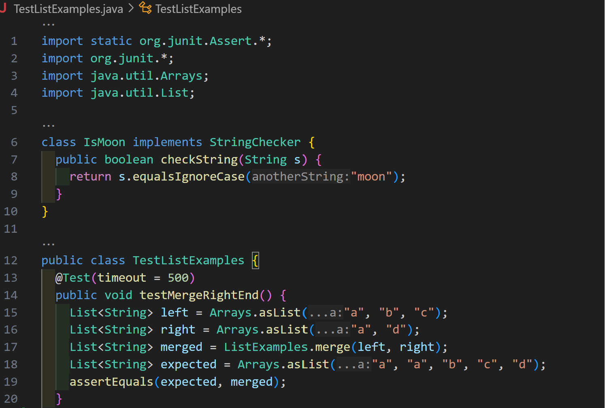
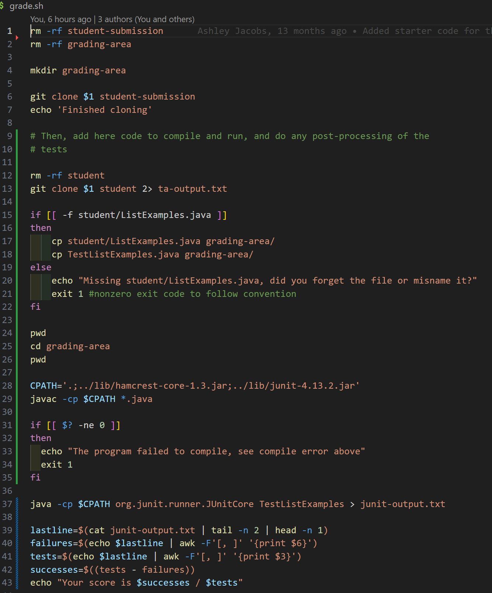
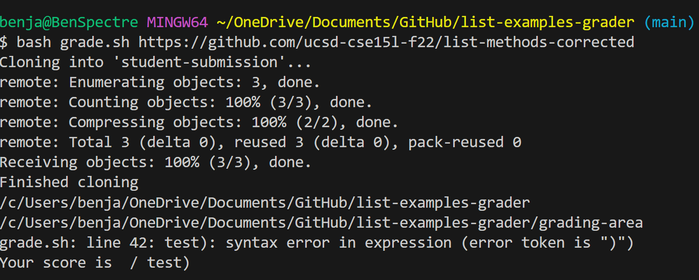
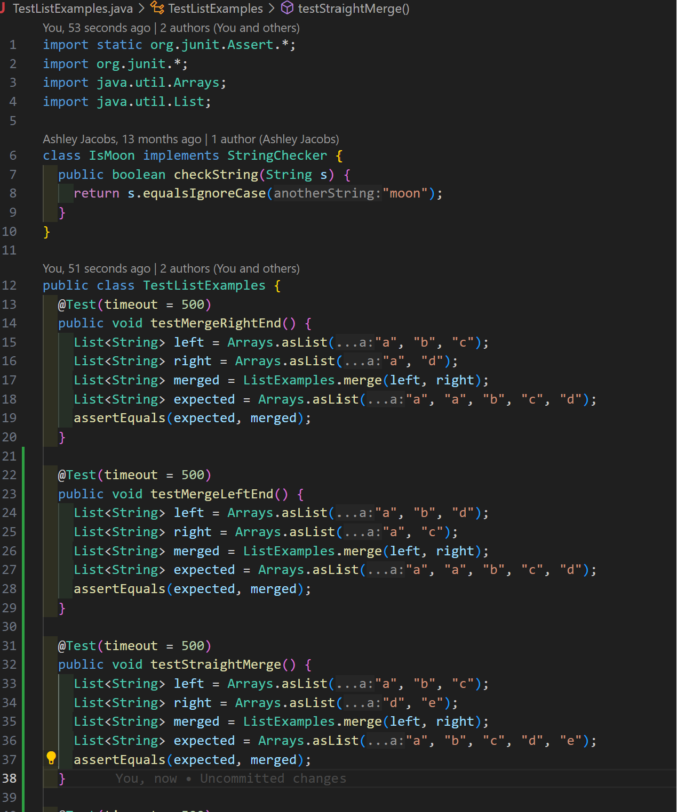
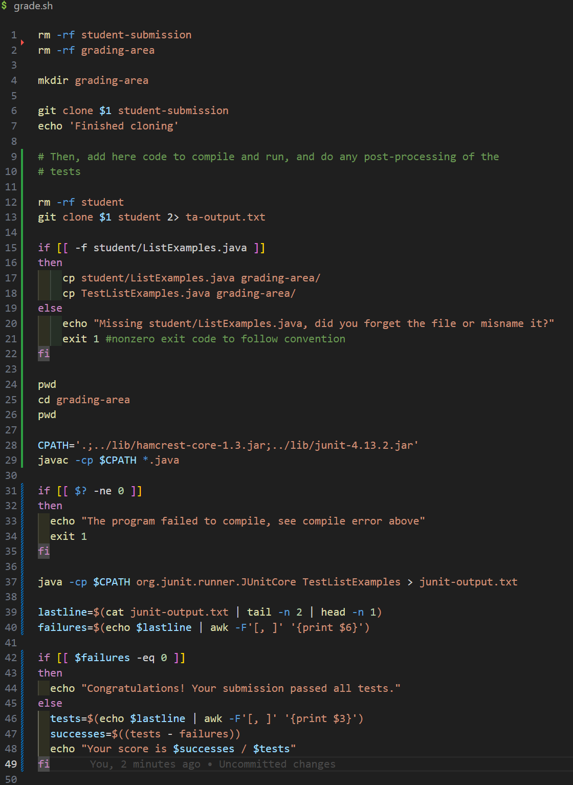
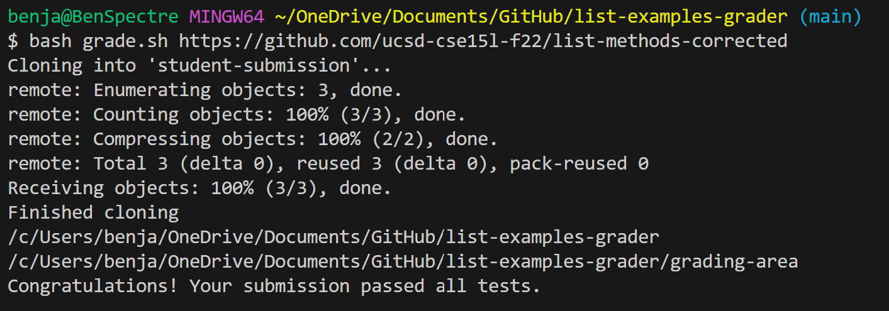

## Part 1 - Debugging Scenario
The issue that is being depicted in the scenario is a student struggling to understand how to implement an `if` statement in bash. The student wants to use the `if` statement to create another case where the bash script outputs a success message after grading a submission that passes all testcases. Right now the bug would be the empty score that is being returned from the student's `grade.sh` scriptThe student submits both his `TestListExamples.java` and `grade.sh` files for the TA to observe and help.

# Student: 
Hi I'm having trouble formulating the code in my bash script to include a case where the submission passes all test cases. I noticed that the JUnit does not output the amount of tests failed so my original code shown does not correctly reflect that the submission passed all tests. Right now it's showing that successes and tests are empty. If I can get help on this I would greatly appreciate it!

# TA: 
Hi, have you considered how you can determine if the submission passed all test cases? (Hint: Use your failures variable as a counter) Also, consider adding more testcases to your test file.

# Student:
Hi thank you for helping me! I used the failure variable as a counter like you mentioned and checked if it was not equal to 0 and formulated my output around that. I also added more test cases! 

## Part 2 - Reflection
Something that I found really cool and useful was using scripts and bash. When testing code in both CSE 15L and 12 I found it incredibly useful to just setup a script to run a set of commands that I would normally have to run multiple times. After coding the script, with just one command I can run the test cases, redirect their output so I can analyze them, and even delete folders and files so I do not have anything that would conflict with each other. It has definitely become a very strong and useful tool in the way I program.
